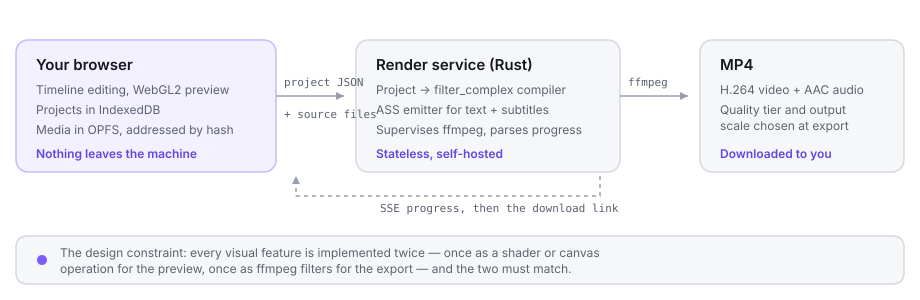

# Vikado

[](https://github.com/koneb71/vikado/actions/workflows/ci.yml)
[](LICENSE)

A free, open-source, web-based video editor: multi-track timeline, effects,
keyframe animation, text, subtitles and MP4 export.

Vikado is local-first. Editing, preview and export all happen in your browser —
projects live in IndexedDB and media in OPFS, and the default export path encodes
the MP4 on your own GPU, so your files need never leave the machine. There is no
account to create.

A small stateless Rust service is also included. It renders the same project with
ffmpeg and is useful when a browser lacks WebCodecs, when a source file is one the
browser cannot decode, or when you would rather not spend local CPU on encoding.
It ships as a single Docker container, so the whole editor is self-hostable.



> A screenshot of the editor is still missing — see
> [issue-worthy contributions](CONTRIBUTING.md#good-first-contributions) if you would
> like to take one.

## Features

### Timeline and editing

- Multi-track timeline with video, audio and text tracks (track 0 is the bottom layer).
- Trim, split, move between tracks, duplicate, copy/paste, and delete clips.
- Snapping with on-screen guides, drag-and-drop from the media panel, a per-clip
  context menu, and a resizable timeline.
- Per-clip thumbnails and audio waveforms.
- Undo/redo over the whole document, plus keyboard shortcuts (press `?` in the editor
  for the full list).
- Import video, audio and images. Files are stored content-addressed in OPFS and
  probed for duration, dimensions and frame rate.
- Per-clip speed from 0.25x to 4x with pitch-corrected audio, horizontal and vertical
  flip, opacity, position, scale, rotation, volume, and audio fades.
- Detach audio splits a video clip's sound onto its own track; freeze frame captures
  the current frame and ripple-inserts a still across all tracks and subtitle cues.

### Effects and animation

- Colour adjustments: brightness, contrast, saturation and temperature.
- Twelve filter presets: grayscale, sepia, vintage, cool, warm, invert, noir, vivid,
  faded, cyberpunk, sunset and mint. Each is one colour matrix in the shader and the
  equivalent ffmpeg chain in the renderer.
- Eleven transitions: crossfade, fade through black or white, wipes in four directions
  and slides in four directions.
- Chroma key (green screen) with adjustable similarity and edge blend.
- Background blur fill, so vertical media on a landscape canvas gets a blurred backdrop.
- Source cropping.
- Keyframe animation on position, scale, rotation and opacity, with linear, ease-in,
  ease-out and ease-in-out easing. Diamond toggles in the inspector add keyframes at
  the playhead and markers show them on the timeline clip.

### Text and subtitles

- Text overlays using thirteen bundled fonts across sans, serif, display, script,
  handwriting and mono. The same TTFs feed the browser preview and libass on the server,
  so text lands in the same place in both.
- Fourteen one-click style presets, plus alignment, outline, background box, drop
  shadow, letter spacing, uppercase/lowercase and fades.
- Entrance and exit animations: slide from any of four directions, zoom in or zoom out,
  set independently for the way in and the way out.
- A subtitle cue editor with SRT import and export.
- Auto-captions from Whisper, running in the browser via `@huggingface/transformers`
  (`onnx-community/whisper-base`). It uses WebGPU where the browser exposes it and
  WebAssembly otherwise. Your audio is never uploaded; the model weights are fetched
  from the Hugging Face hub on first use and cached by the browser after that. Eleven
  languages are selectable, plus auto-detect.

### Recording and capture

- Screen recording and webcam recording through `MediaRecorder`, straight into the
  media library.
- Optional microphone mixing, including mixing the mic into a screen capture that
  already has system audio.
- `MediaRecorder`'s WebM output carries no duration header, so Vikado patches it when
  the recording is saved and the media prober keeps a second backstop for any streamed
  WebM that still reports an unknown duration.

### Export

Two engines produce the same MP4 (H.264 video, AAC audio); pick one at export time.

- **This device.** The timeline is rendered with your GPU and encoded by the
  browser's hardware H.264 encoder (WebCodecs). Nothing is uploaded and no server
  is needed. Frames come from the same compositor that drives the preview, so the
  file matches what you were watching. Used by default where the browser supports
  it, and roughly real time — a six-second 1080p project encodes in a few seconds.
- **Render service.** The project and its source files are uploaded to the Rust
  service, which compiles them into an ffmpeg filter graph. Use it when the
  browser lacks WebCodecs, for sources the browser cannot decode, or to keep
  encoding off the machine you are editing on.

Both offer a quality tier (draft, standard or high) and an output scale (100%,
75% or 50% of the canvas), and both report live progress before the download.

Project settings cover canvas size presets (1080p and 720p landscape, portrait and
square), frame rate (24, 25, 30, 50 or 60) and the canvas background colour.

## Quick start

One container builds and serves both the editor and the render service.

```sh
docker compose up --build
```

Then open <http://localhost:3005>.

`docker-compose.yml` maps host port 3005 to port 3000 in the container. Override it
with `VIKADO_PORT` if 3005 is taken (`VIKADO_PORT=3010 docker compose up --build`); edit the
mapping to use a different host port. Render jobs are written to the `vikado-data`
volume and swept after `VIKADO_JOB_TTL_HOURS` (24 by default).

[docs/SELF_HOSTING.md](docs/SELF_HOSTING.md) covers the configuration variables,
running without Compose, putting the service behind a reverse proxy, and sizing.

## Development

You need Node 22 and pnpm 11, a stable Rust toolchain, and ffmpeg on your `PATH`.

Start the editor. Vite serves it on port 5173 and proxies `/api` to the render
service on port 3000.

```sh
cd web && pnpm install && pnpm dev
```

Start the render service in another terminal.

```sh
VIKADO_FONTS_DIR=web/public/fonts cargo run -p vikado-server
```

Set `VIKADO_PORT` to move the service, and point the frontend at it with
`VIKADO_API_URL` (for example `VIKADO_API_URL=http://localhost:3111 pnpm dev`).

You can also render a project file without running the server at all. Assets in
the assets directory must be named by their content hash, as the editor uploads them.

```sh
cargo run -p vikado-renderer -- project.json assets-dir out.mp4 --fonts web/public/fonts
```

Both halves also run in Docker with hot reload — the editor on
<http://localhost:51731>, the render service on host port 3006 (container 3000).
Override either with `VIKADO_WEB_PORT` / `VIKADO_DEV_PORT`.

```sh
docker compose -f docker-compose.dev.yml up --build
```

### Tests

Frontend unit tests:

```sh
cd web && pnpm vitest run
```

Type-check the frontend and verify the generated TypeScript bindings still match
the Rust schema:

```sh
cd web && pnpm build
```

Rust tests, including the insta snapshots of the emitted ffmpeg filter graph:

```sh
cargo test
```

If you change the Rust schema, regenerate the TypeScript bindings — CI fails if the
checked-in output drifts:

```sh
TS_RS_EXPORT_DIR=../../web/src/generated cargo test -p vikado-types export
```

See [CONTRIBUTING.md](CONTRIBUTING.md) for the golden-render tests that shell out to
real ffmpeg, how to review snapshot changes, and the lint and formatting checks CI
enforces (`pnpm lint`, `cargo fmt --all --check` and clippy with warnings denied).

## How it works

The browser owns the project. React and a WebGL2 compositor drive a real-time
preview from a zod-validated project document; the Rust service is stateless and
only sees a project during an export.

Exporting creates a job, uploads the referenced source files by content hash,
submits the project JSON, streams progress back over SSE, and downloads the result.
The renderer compiles the same project document into an ffmpeg `filter_complex`
graph that mirrors the preview's layer stack, and emits an ASS subtitle file for
text and captions that libass draws with the same TTFs the browser used.

That mirroring is the central design constraint: **every visual feature is
implemented twice, once in GLSL or Canvas and once as ffmpeg filters, and the two
implementations must produce the same image.** Both sides carry matching "contract"
comments — colour math, filter presets, chroma keying, keyframe sampling, cropping
and transition windows — and those pairs have to be changed together.

[docs/ARCHITECTURE.md](docs/ARCHITECTURE.md) explains the pipeline, the contracts
and the repository layout in detail.

## Project status

Version 0.1.0 — the first public release. The feature list above is implemented and
covered by tests, but the project is young and the project schema may still change
between releases. [CHANGELOG.md](CHANGELOG.md) records what landed in each version.

Known limitations:

- **The render service has no authentication.** Anyone who can reach it can submit
  render jobs and download the results. Exporting on your own device avoids the
  service entirely.
- **Exporting on this device changes the pitch of sped-up audio.** The browser mixes
  clip speed by resampling, so a clip at 2x sounds an octave high; ffmpeg's `atempo`
  and the live preview both preserve pitch. Export through the render service if a
  project has audible clips at a speed other than 1x.
- **Exporting on this device runs on the main thread.** The editor is unresponsive
  while frames are encoded, and a long project holds the whole mix in memory.
- **Text clips cannot be keyframe-animated.** The ASS exporter cannot express it, so
  the editor hides the keyframe toggles for text rather than let the preview drift
  from the export.
- **Background blur is not pixel-exact.** The preview's Canvas2D blur and ffmpeg's
  `gblur` agree on geometry and content, but not on the exact kernel.
- **Heavily layered projects strain the preview.** The media pool keeps at most six
  decoded video elements alive and evicts the least recently used, so projects with
  more simultaneous video layers than that will thrash while the export renders fine.
- **Scrubbing performance depends on the source files.** The preview seeks real
  `<video>` elements, so how responsive scrubbing feels comes down to the browser's
  decoder and how the media is encoded.

## Contributing

Contributions are welcome. [CONTRIBUTING.md](CONTRIBUTING.md) covers the development
setup, the test suite, the preview/render parity rules to follow when touching a
visual feature, and what to include in a pull request.

## Security

The render service ships with **no authentication and permissive CORS**. It is meant
to be run on localhost or behind something that handles access control. Do not expose
it directly to the internet: put it behind a reverse proxy that enforces
authentication, and keep `VIKADO_MAX_UPLOAD_BYTES` and `VIKADO_MAX_CONCURRENT_RENDERS`
set to values your host can absorb.

To report a vulnerability, see [SECURITY.md](SECURITY.md).

## License

[MIT](LICENSE)
